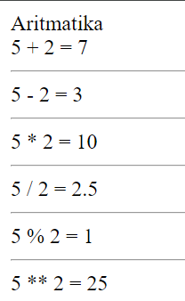
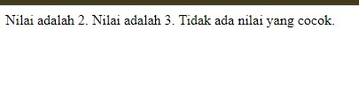
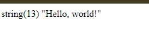
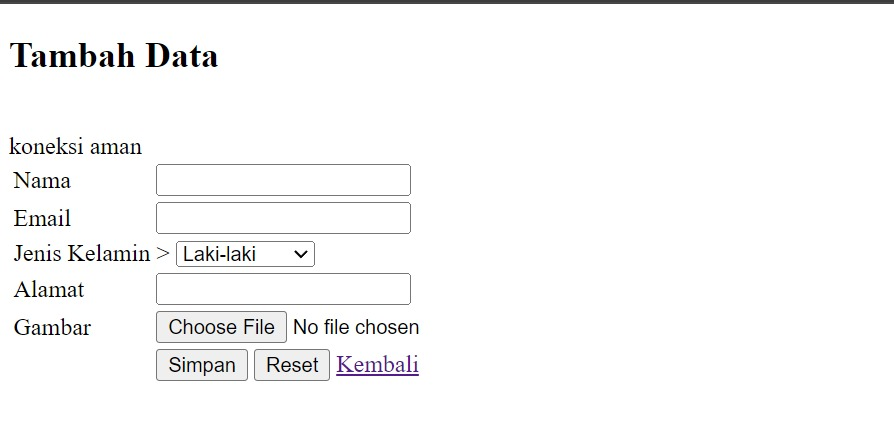

# Apa itu web dinamis dan PHP
## Web dinamis
Sebuah situs web dinamis adalah situs yang mampu menyesuaikan kontennya secara otomatis berdasarkan permintaan pengguna atau data yang diinput. Ini berbeda dengan situs statis yang kontennya tetap tidak berubah kecuali diperbarui secara manual.
## PHP
PHP adalah singkatan dari "Hypertext Preprocessor". Ini adalah bahasa pemrograman yang banyak digunakan untuk pengembangan web. PHP biasanya digunakan untuk membuat situs web dinamis, karena dapat berinteraksi dengan database, menghasilkan halaman web secara dinamis, dan melakukan berbagai tugas pemrosesan data di sisi server.


# Langkah-langkah

1. Buka AWebServer, kemudian klik izinkan jika belum pada 'apk AWebServer'
2. Terus klik document root pada "AWebServer"
3. Setelah itu klik internal 
4. Kemudian cari folder yang sudah kita bikin
5. Lalu klik centang pada folder yang sudah kita bikin
6.  Open Acode 
9. Open folder yang sudah Anda buat di file meneger 
10. Buat file baru di Acode dengan ekstensi `.php` di folder yang sudah Anda buka

# PHP Dasar
## Echo & Comentar
### Echo 
Echo adalah perintah yang digunakan untuk menampilkan teks atau variabel ke layar atau browser. Ini digunakan untuk menghasilkan output pada halaman web. Misalnya, `echo "Hello, world!";` akan menampilkan "Hello, world!" di halaman web yang terkait.

```php
<?php
echo "Hello, world";
?>
```

### Comentar 
Komentar digunakan untuk memberikan penjelasan atau catatan di dalam kode yang tidak dieksekusi oleh server. Untuk satu baris, gunakan `//`. Untuk komentar multi-baris, gunakan `/*  */`.

```php
<?
// Ini adalah komentar satu baris

/*
Ini adalah komentar
beberapa baris
*/
?>
```

## Variabel & Conts
### Variabel
Variabel dalam PHP adalah wadah untuk menyimpan data yang bisa berubah-ubah selama eksekusi program. Mereka bisa menyimpan nilai sementara seperti teks, angka, atau bahkan objek yang kompleks.
```php
<?php
  // Deklarasi variabel
  $nama_variabel;

  // Inisialisasi variabel
  $nama_variabel = nilai;

  // Penggunaan variabel
  echo $nama_variabel;
?>
```

### Conts
`const` dalam PHP digunakan untuk mendefinisikan konstanta. Konstanta adalah nilai yang tidak dapat diubah selama eksekusi skrip. Dengan menggunakan `const`, Anda dapat membuat konstanta di dalam kelas atau di luar kelas tanpa menggunakan operator `$`.
```php
<?php

// Mendefinisikan sebuah konstanta
const NAMA_KONSTANTA = nilai;

// Menggunakan konstanta
echo NAMA_KONSTANTA;

?>
```

## Operator 
### Aritmatika
#### Penjelasan
Operator aritmatika merupakan operator untuk melakukan operasi aritmatika.
Operator aritmatika terdiri dari:

| Nama Operator | Simbol |
| ------------- | ------ |
| Penjumlahan   | `+`    |
| Pengurangan   | `-`    |
| Perkalian     | `*`    |
| Pemangkatan   | `**`   |
| Pembagian     | `/`    |
| Sisa Bagi     | `%`    |

#### Program
```php
$a = 5;
$b = 2;
// penjumlahan
$c = $a + $b;
echo "$a + $b = $c";
echo "<hr>";
// pengurangan
$c = $a - $b;
echo "$a - $b = $c";
echo "<hr>";
// Perkalian
$c = $a * $b;
echo "$a * $b = $c";
echo "<hr>";
// Pembagian
$c = $a / $b;
echo "$a / $b = $c";
echo "<hr>";
// Sisa bagi
$c = $a % $b;
echo "$a % $b = $c";
echo "<hr>";
// Pangkat
$c = $a ** $b;
echo "$a ** $b = $c";
```
#### Hasil



### Perbandingan 
#### Penjelasan
Operator perbandingan adalah operator untuk membandingkan dua buah nilai.
Hasil operasi dari operator perbandingan akan menghasilkan nilai dengan tipe data _boolean_, yaitu `true` (benar) dan `false` (salah).
Berikut ini daftar operator relasi:

| Nama Operator           | Simbol          |
| ----------------------- | --------------- |
| Lebih Besar             | `>`             |
| Lebih Kecil             | `<`             |
| Sama Dengan             | `==` atau `===` |
| Tidak Sama dengan       | `!=` atau `!==` |
| Lebih Besar Sama dengan | `>=`            |
| Lebih Kecil Sama dengan | `<=`            |
#### Program
```php
// lebih besar
$c = $a > $b;
echo "$a > $b: $c";
echo "<hr>";
// lebih kecil
$c = $a < $b;
echo "$a < $b: $c";
echo "<hr>";
// lebih sama dengan
$c = $a == $b;
echo "$a == $b: $c";
echo "<hr>";
// lebih tidak sama dengan
$c = $a != $b;
echo "$a != $b: $c";
echo "<hr>";
```
#### Hasil


### Logika
#### Penjelasan
Operator logika adalah operator untuk melakukan operasi logika seperti `AND`, `OR`, dan `NOT`.
Operator logika terdiri dari:

| Nama Operator         | Simbol |
| --------------------- | ------ |
| Logika AND            | `&&`   |
| Logika OR             | `\|`   |
| Negasi/kebalikan/ NOT | `!`    |
#### Program
```php
$a = true;
$b = false;
// variabel $c akan bernilai false
$c = $a && $b;
printf("%b && %b = %b", $a,$b,$c);
echo "<hr>";
// variabel $c akan bernilai true
$c = $a || $b;
printf("%b || %b = %b", $a,$b,$c);
echo "<hr>";
// variabel $c akan bernilai false
$c = !$a;
printf("!%b = %b", $a, $c);
echo "<hr>";
```
#### Hasil


## Conditional statement
### IF
#### Penjelasan 

Struktur kontrol if digunakan untuk mengevaluasi suatu kondisi. Jika kondisi tersebut benar (true), maka blok kode di dalam if akan dieksekusi. Jika tidak, blok kode tersebut akan dilewati.

#### Struktur 

```php
<?php
if (kondisi) {  
    // Blok kode yang akan dieksekusi jika kondisi benar  
} 
?>
```

#### Program 

```php
<?php
$nilai = 80;

if ($nilai <= 81) {
    echo "Anda lulus!";
}
?>
```

#### Hasil


#### Analisis 

Dalam program ini, hanya satu kondisi yang dievaluasi. Jika kondisi tersebut benar, maka pesan "Anda lulus!" akan ditampilkan. Jika tidak, tidak ada tindakan yang diambil.

#### Kesimpulan Program 

Program menggunakan if tanpa else dapat berguna ketika hanya satu tindakan yang perlu dilakukan jika kondisi benar.

### IF-ELSE
#### Penjelasan 

IF-ELSE adalah struktur kontrol yang memungkinkan program untuk melakukan pengujian kondisi dan menjalankan blok kode tertentu berdasarkan hasil pengujian kondisi tersebut. Dengan IF-ELSE, Anda dapat menentukan tindakan yang berbeda tergantung pada apakah kondisi yang diberikan adalah benar atau salah.

#### Struktur 

```php
<?php
if (kondisi) {
    // blok kode yang dijalankan jika kondisi bernilai benar
} else {
    // blok kode yang dijalankan jika kondisi bernilai salah
}
?>
```

#### Program 

```php
<?php
$nilai = 75;

if ($nilai >= 70) {
    echo "Selamat, Anda lulus!";
} else {
    echo "Maaf, Anda belum lulus.";
}
?>
```

#### Hasil


#### Analisis 

Jika nilai lebih besar dari atau sama dengan 70, pesan "Selamat, Anda lulus!" akan ditampilkan. Jika tidak, pesan "Maaf, Anda belum lulus." akan ditampilkan.

#### Kesimpulan Program 

Dengan IF-ELSE, Anda dapat membuat keputusan berdasarkan kondisi tertentu dalam program PHP Anda. Ini memungkinkan untuk mengontrol alur program secara dinamis berdasarkan kondisi yang ditentukan.

### IF-ELSE IF-ELSE
#### Penjelasan 

IF-ELSE IF-ELSE digunakan untuk membuat struktur kondisional di PHP. Program mengevaluasi kondisi pertama, jika benar, blok kode di dalam IF dieksekusi. Jika tidak, program mengevaluasi kondisi kedua dalam ELSE IF, dan seterusnya. ELSE adalah bagian akhir dari struktur kondisional yang dieksekusi jika tidak ada kondisi sebelumnya yang benar.

#### Struktur 

```php
<?php
   if (kondisi1) {
       // blok kode jika kondisi1 benar
   } elseif (kondisi2) {
       // blok kode jika kondisi2 benar
   } else {
       // blok kode jika tidak ada kondisi yang benar
   }
   ?>
```

#### Program 

```php
<?php
$nilai = 75;

if ($nilai >= 80) {
    echo "Nilai A";
} elseif ($nilai >= 70) {
    echo "Nilai B";
} elseif ($nilai >= 60) {
    echo "Nilai C";
} else {
    echo "Nilai D";
}
?>
```

#### Hasil


#### Analisis 

Program mengevaluasi setiap kondisi dari atas ke bawah.
   - Jika nilai `$nilai` lebih besar dari atau sama dengan 80, outputnya adalah "Nilai A". Jika tidak, maka akan mengecek kondisi berikutnya.
   - Ini berlanjut sampai program menemukan kondisi yang benar atau jika tidak ada kondisi yang benar, maka bagian ELSE akan dieksekusi.

#### Kesimpulan Program 

 IF-ELSE IF-ELSE struktur kondisional yang berguna untuk mengeksekusi blok kode berdasarkan beberapa kondisi yang berbeda. Ini memungkinkan program untuk mengambil keputusan berdasarkan berbagai situasi yang mungkin terjadi.

### Switch-Case
#### Penjelasan 

Struktur switch-case digunakan untuk melakukan pemilihan terhadap satu nilai dari sejumlah pilihan yang mungkin. Biasanya, ketika suatu kasus dipilih, eksekusi akan keluar dari struktur switch-case menggunakan pernyataan `break`. Namun, jika `break` tidak digunakan, maka eksekusi akan terus berlanjut ke kasus berikutnya tanpa memeriksa kondisi kasusnya.

#### Struktur 

```php
<?php
php
switch ($nilai) {
    case nilai_1:
        // program untuk kasus nilai_1
    case nilai_2:
        // program untuk kasus nilai_2
    ...
    default:
        // program default jika tidak ada kasus yang cocok
}
?>
```

#### Program 

```php
<?php
$nilai = 2;

switch ($nilai) {
    case 1:
        echo "Nilai adalah 1. ";
    case 2:
        echo "Nilai adalah 2. ";
    case 3:
        echo "Nilai adalah 3. ";
    default:
        echo "Tidak ada nilai yang cocok. ";
}
?>
```

#### Hasil



#### Analisis 

`$nilai` adalah 2, maka program akan mencetak pesan untuk kasus 2 dan 3. Namun, pernyataan `break` tidak digunakan, sehingga eksekusi terus ke default setelah mencetak pesan untuk kasus 3.

#### Kesimpulan Program 

Pengguna switch-case tanpa break-case bisa berguna dalam beberapa situasi di mana Anda ingin menjalankan beberapa kode untuk beberapa kasus yang saling terkait tanpa perlu menulis kode yang sama berulang kali. Namun, ini harus digunakan dengan hati-hati karena bisa membingungkan dan sulit dipelihara.

## Array
### Array 1 Dimensi 
#### Penjelasan 

Array 1 dimensi dalam PHP adalah kumpulan nilai yang disimpan dalam satu variabel. Setiap nilai memiliki indeks numerik yang dimulai dari 0. Ini memungkinkan penyimpanan dan pengaksesan data secara terstruktur.

#### Struktur 

```php
<?php
 $nama_array = array(nilai1, nilai2, nilai3, ...);
 ?>
```

#### Program 

```php
<?php
// Mendefinisikan array 1 dimensi
$buah = array("Apel", "Pisang", "Jeruk");

// Mengakses nilai array
echo "Buah pertama adalah " . $buah[0]; // Output: Buah pertama adalah Apel
?>
```

#### Hasil


#### Analisis 

Penggunaan array 1 dimensi memungkinkan pengelolaan data yang efisien, terutama ketika ada kumpulan nilai yang terkait.

#### Kesimpulan Program

Array 1 dimensi di PHP adalah alat yang berguna untuk mengelola dan mengakses kumpulan nilai secara terstruktur. Dengan indeks numerik, nilai-nilai ini dapat diakses dan dimanipulasi dengan mudah.

### Array Asosiatif
#### Penjelasan 

Array asosiatif dalam PHP memungkinkan Anda untuk menyimpan data dengan kunci yang ditentukan oleh pengguna, bukan hanya indeks numerik.

#### Struktur 

```php
<?php
$student = array("nama" => "John", "umur" => 20, "kelas" => "XII");
?>
```

#### Program 

```php
<?php
// Membuat array asosiatif
$student = array("nama" => "John", "umur" => 20, "kelas" => "XII");

// Mengakses nilai dalam array
echo "Nama: " . $student["nama"] . "<br>";
echo "Umur: " . $student["umur"] . "<br>";
echo "Kelas: " . $student["kelas"] . "<br>";
?>
```

#### Hasil


#### Analisis 

- Program ini sederhana namun efektif dalam menunjukkan cara membuat dan mengakses nilai dalam sebuah array asosiatif di PHP.
- Penggunaan kunci yang deskriptif seperti "nama", "umur", dan "kelas" membuat kode menjadi lebih mudah dipahami.

#### Kesimpulan Program

Array asosiatif di PHP adalah alat yang berguna untuk menyimpan data dengan pasangan kunci-nilai. Mereka memungkinkan Anda untuk mengakses nilai dengan menggunakan kunci yang ditentukan pengguna. Hal ini membuat kode lebih fleksibel dan mudah dipelajari.

### Array Multidimensi 
#### Penjelasan 

Array multidimensi adalah array yang berisi satu atau lebih array di dalamnya. Ini memungkinkan Anda untuk menyimpan data dalam bentuk tabel yang terstruktur. Setiap elemen dalam array utama bisa menjadi array sendiri, membentuk struktur data bertingkat.

#### Struktur 

```php
<?php
$nama_array = array(
    array(nilai1, nilai2, nilai3),
    array(nilai1, nilai2, nilai3),
    array(nilai1, nilai2, nilai3)
);
?>
```

#### Program 

```php
<?php
$nilai = array(
    array(80, 75, 90),
    array(85, 70, 85),
    array(90, 80, 85)
);

echo "Nilai siswa:<br>";
echo "Siswa 1: Matematika=".$nilai[0][0].", Fisika=".$nilai[0][1].", Kimia=".$nilai[0][2]."<br>";
echo "Siswa 2: Matematika=".$nilai[1][0].", Fisika=".$nilai[1][1].", Kimia=".$nilai[1][2]."<br>";
echo "Siswa 3: Matematika=".$nilai[2][0].", Fisika=".$nilai[2][1].", Kimia=".$nilai[2][2]."<br>";
?>
```

#### Hasil


#### Analisis 

Program di atas menghasilkan daftar nilai siswa dalam tiga mata pelajaran. Dengan menggunakan array multidimensi, data nilai siswa disusun dalam struktur yang terorganisir.

#### Kesimpulan Program

Array multidimensi adalah alat yang berguna dalam menyimpan dan mengorganisir data dalam bentuk tabel bertingkat di PHP.

## Var_dump
### Penjelasan 

`var_dump()` adalah sebuah fungsi di PHP yang digunakan untuk menampilkan informasi struktur dan tipe data dari suatu variabel. Fungsi ini sangat berguna dalam debugging karena memberikan informasi detail tentang variabel yang sedang diperiksa, termasuk tipe data, panjang (jika array atau string), dan nilai-nilai yang disimpan di dalamnya.

### Struktur 

```php
<?php
$variable = "Hello, world!";
var_dump($hasil);
?>
```

### Program 

```php
<?php
$variable = "Hello, world!";
var_dump($variable);
?>
```

### Hasil



### Analisis 

Program di atas menetapkan sebuah string ke variabel `$variable`, kemudian memanggil fungsi `var_dump()` untuk menampilkan informasi tentang variabel tersebut. Dalam hal ini, `var_dump()` akan menampilkan tipe data dari variabel (`string(13)` karena variabel tersebut merupakan string dengan panjang 13 karakter) dan nilai yang disimpan di dalamnya (`"Hello, world!"`).

### Kesimpulan Program

Dengan menggunakan fungsi `var_dump()`, kita dapat dengan mudah memeriksa tipe data dan nilai dari suatu variabel dalam PHP. Ini sangat membantu dalam proses debugging untuk memastikan bahwa variabel berisi nilai yang diharapkan.

## Looping (Perulangan)
### FOR
#### Penjelasan 

`for` digunakan untuk melakukan iterasi sejumlah tertentu dengan ekspresi awal, kondisi, dan ekspresi peningkatan. Ini sangat berguna saat Anda ingin melakukan sesuatu sejumlah kali yang sudah diketahui.

#### Struktur 

```php
<?php
for (ekspresi awal; kondisi; ekspresi peningkatan) {
    // kode yang akan diulangi
}
?>
```

#### Program 

```php
<?php
for ($i = 0; $i < 5; $i++) {
    echo "Nilai i adalah: $i <br>";
}
?>
```

#### Hasil


#### Analisis 

Dalam program contoh di atas, loop `for` dijalankan lima kali dengan nilai `$i` mulai dari 0 dan berhenti saat `$i` kurang dari 5. Setiap iterasi, nilai `$i` ditampilkan.

#### Kesimpulan Program

Loop `for` sangat berguna untuk melakukan iterasi sejumlah tertentu dalam sebuah program. Dengan menggunakan ekspresi awal, kondisi, dan ekspresi peningkatan, kita bisa mengontrol jumlah iterasi dan aksi yang dilakukan pada setiap iterasi.

### WHILE 
#### Penjelasan 

Perulangan while digunakan untuk menjalankan blok kode selama kondisi tertentu bernilai benar. Saat kondisi tidak lagi benar, perulangan berhenti.

#### Struktur 

```php
<?php
while (kondisi) {
    // kode yang akan dijalankan selama kondisi benar
}
?>
```

#### Program 

```php
<?php
$angka = 1;

while ($angka <= 5) {
    echo $angka . "<br>";
    $angka++;
}
?>
```

#### Hasil


#### Analisis 

Dalam program ini, variabel `$angka` diinisialisasi dengan nilai 1. Selama nilai `$angka` kurang dari atau sama dengan 5, blok kode dalam perulangan while akan dijalankan. Setiap iterasi, nilai `$angka` akan dicetak dan kemudian ditambah satu.

#### Kesimpulan Program

Perulangan while di PHP adalah alat yang berguna untuk menjalankan blok kode berulang kali selama kondisi tertentu terpenuhi. Dalam contoh ini, perulangan while digunakan untuk mencetak angka dari 1 hingga 5, menunjukkan fleksibilitas dan kekuatan perulangan dalam bahasa pemrograman PHP.

### do-while
#### Penjelasan 

Do while loop adalah jenis perulangan yang akan mengeksekusi blok kode setidaknya sekali, kemudian akan terus dieksekusi selama kondisi yang ditentukan masih benar.

#### Struktur 

```php
<?php
// Inisialisasi variabel atau kondisi awal
do {
    // Blok kode yang akan dieksekusi minimal satu kali
} while (kondisi);
?>
```

#### Program 

```php
<?php
// Inisialisasi variabel
$counter = 0;
$items = array("Apel", "Jeruk", "Pisang");

// Eksekusi minimal satu kali
do {
    echo $items[$counter] . "<br>";
    $counter++;
} while ($counter < count($items));
?>
```

#### Hasil


#### Analisis 

Dengan menggunakan do while loop, program menjamin bahwa setidaknya satu pernyataan akan dieksekusi sebelum kondisi pengecekan dilakukan. Hal ini berguna dalam situasi di mana Anda ingin memastikan bahwa blok kode dijalankan minimal sekali sebelum memeriksa kondisi.

#### Kesimpulan Program

Program tersebut berhasil mencetak semua item dalam array buah menggunakan do while loop. Ini menunjukkan kegunaan do while loop dalam menjalankan sebuah blok kode minimal sekali dan kemudian mengulanginya selama kondisi tertentu masih terpenuhi.

### Foreach
#### Penjelasan 

`foreach` digunakan untuk mengulangi setiap elemen dalam array. Dapat digunakan untuk array asosiatif (menggunakan pasangan kunci-nilai) atau array indeks (menggunakan indeks numerik). Menyederhanakan proses pengulangan daripada menggunakan loop `for` atau `while`.

#### Struktur 

```php
<?php
foreach ($array as $nilai) {
       // Lakukan sesuatu dengan $nilai
   }
?>
```

#### Program 

```php
<?php
   $buah = array("apel", "jeruk", "pisang", "anggur");

   foreach ($buah as $item) {
       echo $item . "<br>";
   }
?>
```

#### Hasil


#### Analisis 

Program menggunakan `foreach` untuk mengulangi setiap elemen dalam array `$buah`. Setiap elemen disimpan dalam variabel `$item`.Dalam loop, setiap elemen dicetak.

#### Kesimpulan Program

Penggunaan `foreach` dalam PHP mempermudah pengulangan dan pengelolaan setiap elemen dalam array. Ini lebih intuitif daripada menggunakan loop `for` atau `while`, terutama ketika berurusan dengan array yang tidak terbatas atau array asosiatif. Dengan `foreach`, Anda dapat fokus pada manipulasi nilai daripada mengelola indeks.

## Function 
### Penjelasan 

PHP Function adalah blok kode yang dapat dipanggil dan digunakan kembali dalam sebuah skrip PHP. Mereka membantu mengorganisir kode, mengurangi duplikasi, dan meningkatkan keterbacaan.

### Struktur 

```php
<?php
// Deklarasi fungsi
function nama_fungsi($parameter1, $parameter2, ...) {
    // Blok kode fungsi
    // Lakukan sesuatu dengan parameter yang diterima
    return $hasil;
}
// Panggil fungsi
$hasil = nama_fungsi(nilai1, nilai2, ...);
echo $hasil;
?>
```

### Program 

```php
<?php
// Fungsi untuk menghitung luas persegi panjang
function hitungLuasPersegiPanjang($panjang, $lebar) {
    $luas = $panjang * $lebar;
    return $luas;
}
// Panggil fungsi
$luas = hitungLuasPersegiPanjang(5, 10);
echo "Luas persegi panjang adalah: " . $luas;
?>
```

### Hasil


### Analisis 

- Program di atas mendefinisikan sebuah fungsi `hitungLuasPersegiPanjang` yang menerima dua parameter, yaitu panjang dan lebar.
- Fungsi tersebut mengembalikan hasil perkalian panjang dengan lebar, yang merupakan luas persegi panjang.
- Hasil luas kemudian dicetak menggunakan perintah `echo`.

### Kesimpulan Program 

Dengan me
## PHP Form
### Get Method
#### Penjelasan 

Metode GET adalah salah satu cara untuk mengirimkan data dari sisi klien (browser) ke sisi server (PHP) melalui URL. Data yang dikirimkan melalui metode GET akan terlihat dalam URL.

#### Program 

Form:
```php
<!DOCTYPE html>
<html lang="en">

<head>
    <title>Document</title>
</head>

<body>
    <!-- Pada atribut action, kalian tuliskan nama file php yang bertugas untuk mengelola atau menangkap data dari form tersebut. -->
    <form action="process_get.php" method="GET">
        <input type="text" name="nama_lengkap" placeholder="Masukkan nama">
        <input type="number" name="umur" placeholder="Masukkan umur"> <br>
        <button type="submit">Kirim</button>
    </form>
</body>

</html>
```

proses:
```php
<?php

// Key dari array-nya, sesuai dengan nama dari atribut name di setiap input-nya

$nama = $_GET["nama_lengkap"];
$umur = $_GET["umur"];

?>

<!DOCTYPE html>
<html lang="en">
<head>
    <meta charset="UTF-8">
    <meta name="viewport" content="width=device-width, initial-scale=1.0">
    <title>XI RPL 1 - GET</title>
</head>
<body>
    <p>Nama anda
        <!-- Ini adalah versi singkatnya dari php echo,

             yang fungsinya untuk menampilkan data -->
        <?= $nama ?>
    </p>
    <p>Umur anda <?= $umur ?> tahun</p>

</body>
</html>
```

#### Hasil


### Post Method
#### Penjelasan 

Metode POST adalah salah satu cara untuk mengirimkan data dari sisi klien (browser) ke sisi server (PHP) melalui body request HTTP. Data yang dikirimkan melalui metode POST tidak akan terlihat dalam URL.

#### Program 

Form:
```php
<!DOCTYPE html>
<html lang="en">

<head>
    <title>Document</title>
</head>

<body>
    <!-- Pada atribut action, kalian tuliskan nama file php yang bertugas untuk mengelola atau menangkap data dari form tersebut. -->
    <form action="process_post.php" method="POST">
        <input type="text" name="nama_lengkap" placeholder="Masukkan nama">
        <input type="number" name="umur" placeholder="Masukkan umur">
        <input type="password" name="password" placeholder="Masukkan password"><br>
        <button type="submit">Kirim</button>
    </form>
</body>

</html>
```

Proses:
```php
<?php
// Key dari array-nya, sesuai dengan nama dari atribut name di setiap input-nya
$nama = $_POST["nama"];
$umur = $_POST["umur"];

var_dump($_POST);

?>

<!DOCTYPE html>
<html lang="en">

<head>
    <title> XI RPL 1 - POST</title>
</head>

<body>
    <p>Nama anda <?= $_POST["nama_lengkap"] ?></p>
    <p>Umur anda <?= $umur ?> tahun</p>
    <p>Password anda aman!</p>
</body>

</html>
```

#### Hasil


# Koneksi Database 
## Kode Program 

```php 
<?php
  
//koneksi ke database

$koneksi = mysqli_connect('localhost', 'root', '', 'rental_mobil');

  

if ($koneksi) {

    echo "<br> koneksi aman <br>";

} else {

    echo "error, tidak bisa koneksi ke database";

}
```

## Hasil


## Analisis 

1. Kode ini melakukan koneksi ke database menggunakan fungsi `mysqli_connect()`.
2. Fungsi `mysqli_connect()` membutuhkan empat parameter: hostname, username, password, dan nama database.
3. Jika koneksi berhasil, variabel `$koneksi` akan menyimpan objek koneksi.
4. Setelah koneksi, kode melakukan pengecekan apakah koneksi berhasil atau tidak.
5. Jika koneksi berhasil, kode akan menampilkan pesan "koneksi aman".
6. Jika terjadi error saat koneksi, kode akan menampilkan pesan "error, tidak bisa koneksi ke database".

## Kesimpulan 

Merupakan dasar untuk melakukan koneksi ke database menggunakan PHP. Hal ini sangat penting dalam pengembangan aplikasi berbasis web, karena aplikasi biasanya membutuhkan akses ke database untuk menyimpan dan mengambil data.

# Tampilkan Data
## Kode Program 

```php
<!DOCTYPE html>

<html lang="en">

<head>

    <meta charset="UTF-8">

    <meta name="viewport" content="width=device-width, initial-scale=1.0">

    <title>index tabel</title>

</head>

<body>

    <h2>Data Siswa XI RPL 1</h2>

    <table border="5">

    <tr>

        <th>id_siswa</th>

        <th>Gambar</th>

        <th>nama</th>

        <th>email</th>

        <th>jenis_kelamin</th>

        <th>alamat</th>

        <th>Aksi</th>

    </tr>

  

<?php

    include "koneksi.php";

    $i = 1;

    $query = mysqli_query($koneksi, "SELECT * FROM siswa");

    while ($data = mysqli_fetch_array($query)) {

    ?>

  

    <tr>

        <td><?php echo $i; ?></td>

        <td>

            " alt="gambar" width="100px">

        </td>

        <td><?php echo $data['nama']; ?></td>

        <td><?php echo $data['email']; ?></td>

        <td><?php echo $data['jenis_kelamin']; ?></td>

        <td><?php echo $data['alamat']; ?></td>

  

        <td>

            <a href="ubah.php?id=<?= $data['id_siswa']; ?>">Ubah</a> |

            <a href="hapus.php?id=<?= $data['id_siswa']; ?>">Hapus</a> |

        </td>

    </tr>

    <?php

    $i++;

    }

    ?>

    </table>

</body>

</html>
```

## Hasil


## Analisis 

- Deklarasi `<!DOCTYPE html>` menunjukkan bahwa dokumen ini adalah dokumen HTML5. Elemen `<html lang="en">` menunjukkan bahwa bahasa utama dari dokumen ini adalah bahasa Inggris.
- **Meta Tag**: `<meta charset="UTF-8">` menetapkan encoding karakter ke UTF-8. `<meta name="viewport" content="width=device-width, initial-scale=1.0">` memastikan halaman web ditampilkan dengan benar pada perangkat seluler dengan menetapkan lebar viewport sama dengan lebar perangkat.
- **Judul Halaman**: `<title>index tabel</title>` menetapkan judul halaman yang akan muncul di tab browser.
- **Heading**: `<h2>Data Siswa XI RPL 1</h2>` menampilkan heading tingkat 2 dengan teks "Data Siswa XI RPL 1".
- **Tabel**: `<table border="5">` membuat tabel dengan border tebal (5 piksel). Bagian `<tr>` dan `<th>` digunakan untuk membuat header tabel.
- **Menghubungkan ke Database**: `include "koneksi.php";` menyertakan file eksternal yang berisi koneksi ke database. File `koneksi.php` biasanya berisi kode untuk menghubungkan ke database MySQL menggunakan `mysqli_connect`.
- **Inisialisasi Counter**: `$i = 1;` menginisialisasi variabel counter yang digunakan untuk menampilkan nomor urut siswa.
- **Query Database**: `mysqli_query($koneksi, "SELECT * FROM siswa")` menjalankan query SQL untuk mengambil semua data dari tabel `siswa`.
- **Looping Melalui Data**: `while ($data = mysqli_fetch_array($query)) {}` adalah loop yang digunakan untuk iterasi setiap baris hasil query. `mysqli_fetch_array` mengambil hasil query sebagai array asosiatif.
- **Menampilkan Data**: 
  - `<td><?php echo $i; ?></td>` menampilkan nomor urut.
  - `" alt="gambar" width="100px">` menampilkan gambar siswa yang diambil dari direktori `img` dengan lebar 100 piksel.
  - `<td><?php echo $data['nama']; ?></td>`, `<td><?php echo $data['email']; ?></td>`, `<td><?php echo $data['jenis_kelamin']; ?></td>`, `<td><?php echo $data['alamat']; ?></td>` menampilkan data siswa lainnya.
- **Aksi (Ubah dan Hapus)**:
  - `<a href="ubah.php?id=<?= $data['id_siswa']; ?>">Ubah</a> | <a href="hapus.php?id=<?= $data['id_siswa']; ?>">Hapus</a>` membuat link untuk mengubah dan menghapus data siswa berdasarkan `id_siswa`.
- **Inkrementasi Counter**: `$i++;` menambah nilai counter setelah setiap iterasi.

## Kesimpulan

Skrip ini secara keseluruhan berfungsi untuk menampilkan data siswa dalam bentuk tabel dengan informasi dasar seperti nama, email, jenis kelamin, alamat, dan gambar. Setiap baris data juga menyediakan tautan untuk mengubah atau menghapus data siswa tersebut. Integrasi dengan database memungkinkan data ditampilkan secara dinamis.

# Tambahkan Data
## Kode Program 

```php
<!DOCTYPE html>
<html lang="en">
<head>
    <title>Document</title>
</head>
<body>
    <h2>Tambah Data</h2>
    <?php
    include "koneksi.php";
    function upload(): string
{
    $nameImage = $_FILES['gambar']['name'];
    $directoryFile = $_FILES['gambar']['tmp_name'];
    $errorImage = intval($_FILES['gambar']['error']);
    $sizeFile = $_FILES['gambar']['size'];
    // cek apakah gambar ada
    if ($errorImage === 4) {
        echo "<script>alert('Anda Belum Upload Gambar')</script>";
        return false;
    }
    // mengambil ekstensi file
    $validType = ['svg', 'jpg', 'png', 'jpeg', 'webp'];
    $extensionFile = explode(".", $nameImage);
    $extensionValid = strtolower(end($extensionFile));
    // cek apakah yang diupload gambar atau bukan
    if (!in_array($extensionValid, $validType)) {
        echo "<script>alert('yang anda Upload bukan gambar')</script>";
        return false;
    }

    // cek size file
    if ($sizeFile > 3_000_000) {
        echo "<script>alert('Ukuran File Terlalu Besar!!(Maks 3MB)')</script>";
        return false;
    }

    // upload file
    $nameImage = uniqid() . "." . $extensionValid;
    move_uploaded_file($directoryFile, "img/{$nameImage}");

    // mengembalikan namafile yg sudah divalidasi
    return $nameImage;
}

    if (isset($_POST['simpan'])) {
        $nama = $_POST['nama'];
        $email = $_POST['email'];
        $jenis_kelamin = $_POST['jenis_kelamin'];
        $alamat = $_POST['alamat'];
        $gambar = upload();
        if (!$gambar) {
            return false;
        }
  
        // * true / false
        $query = mysqli_query($koneksi, "INSERT into
        siswa(nama,email,jenis_kelamin,alamat,gambar)
        values ('$nama','$email','$jenis_kelamin','$alamat','$gambar')");

        if ($query == true) {
            echo "<script>
            alert('Tambah data Berhasil')
            window.location.href='table.php'
            </script>";
        } else {
            echo '<script>alert("Tambah data gagal")</script>';
        }
    }
    ?>
    <form method="post" enctype="multipart/form-data">
        <table>
            <tr>
                <td>Nama</td>
                <td><input type="text" name="nama"></td>
            </tr>
            
            <tr>
                <td>Email</td>
                <td><input type="text" name="email"></td>
            </tr>
            
            <tr>
                <td>Jenis Kelamin</td>
                <td>>
                    <select name="jenis_kelamin">
                        <option>Laki-laki</option>
                        <option>Perempuan</option>
                    </select>
                </td>
            </tr>

            <tr>
                <td>Alamat</td>
                <td><input type="text" name="alamat"></td>
            </tr>

            <tr>
                <td>Gambar</td>
                <td><input type="file" name="gambar"></td>
            </tr>

            <tr>
                <td></td>
                <td>
                    <button name="simpan" type="submit">Simpan</button>
                    <button type="reset">Reset</button>
                    <a href="table.php">Kembali</a>
                </td>
            </tr>
        </table>
    </form>
</body>
</html>
```

## Hasil




## Analisis 

1. **Koneksi ke Database**:
   - Program ini menggunakan file `koneksi.php` untuk menghubungkan ke database. Hal ini memisahkan konfigurasi database dari kode utama, memudahkan pemeliharaan dan perubahan koneksi di kemudian hari.

2. **Fungsi `upload()`**:
   - Fungsi ini bertanggung jawab untuk memvalidasi dan memproses unggahan gambar. Ini mencakup:
     - Memeriksa apakah file gambar telah diunggah.
     - Memvalidasi tipe file gambar yang diizinkan (SVG, JPG, PNG, JPEG, WEBP).
     - Memvalidasi ukuran file gambar maksimum (3MB).
     - Menyimpan file gambar ke direktori `img/` dengan nama unik.
   - Fungsi ini mengembalikan nama file gambar yang valid atau `false` jika terjadi masalah.

3. **Penanganan Formulir**:
   - Saat pengguna mengirimkan formulir, program ini akan menerima data dari form (nama, email, jenis kelamin, alamat, gambar).
   - Data yang valid akan dimasukkan ke dalam database menggunakan query SQL `INSERT`.
   - Jika proses penyimpanan berhasil, akan ditampilkan pesan sukses dan pengguna akan diarahkan ke halaman `table.php`.
   - Jika proses penyimpanan gagal, akan ditampilkan pesan kesalahan.

4. **Tampilan Halaman**:
   - Halaman ini menampilkan formulir dengan input untuk nama, email, jenis kelamin, alamat, dan unggah gambar.
   - Terdapat tombol "Simpan" untuk menyimpan data, "Reset" untuk mengosongkan form, dan "Kembali" untuk mengarahkan pengguna ke halaman `table.php`.

Secara keseluruhan, program ini menyediakan fungsionalitas dasar untuk menambahkan data siswa ke dalam database, dengan validasi terhadap unggahan gambar.

## Kesimpulan 

1. Tujuan Program:
   - Program ini bertujuan untuk memungkinkan pengguna mengelola data siswa, seperti menambahkan, menyimpan, dan mengakses informasi siswa.

2. Fitur Utama:
   - Unggah dan validasi gambar siswa.
   - Penyimpanan data siswa ke dalam database.
   - Umpan balik kepada pengguna terkait proses penyimpanan data.

3. Struktur Program:
   - Terdiri dari antarmuka web (HTML) dan logika server-side (PHP).
   - Antarmuka web menyediakan formulir untuk memasukkan data siswa.
   - Logika server-side menangani proses penyimpanan data ke database.

4. Aspek Keamanan dan Optimasi:
   - Perlu ada peningkatan dalam aspek keamanan, seperti validasi input untuk mencegah serangan SQL Injection.
   - Proses unggah dan penyimpanan gambar dapat dioptimalkan, misalnya dengan melakukan resizing atau kompresi.

# Ubah Data
## Kode Program 

```php

<!DOCTYPE html>

<html lang="en">  

<head>

    <title>Document</title>

</head>
<body>

    <h2>Ubah Data</h2>

    <?php

    include "koneksi.php";

    $id = $_GET['id'];  

    if (isset($_POST['simpan'])) {

        $nama = $_POST['nama'];

        $email = $_POST['email'];

        $jenis_kelamin = $_POST['jenis_kelamin'];

        $alamat = $_POST['alamat'];
        $query = mysqli_query($koneksi, "UPDATE siswa SET

                                        nama='$nama',                      email='$email',                     jenis_kelamin='$jenis_kelamin',     alamat='$alamat'
    WHERE id_siswa=$id");

        if ($query) {

            echo "<script>

            alert('ubah data Berhasil')

            window.location.href='table.php'

            </script>";

        } else {

            echo '<script>alert("ubah data gagal")</script>';

        }

    }  

    $query = mysqli_query($koneksi, "SELECT * FROM siswa where id_siswa=$id");

    $data = mysqli_fetch_array($query);

    if ($data == "") {

        die('Data tidak ada');

    }

    ?>

    <form method="post">

        <table>

            <tr>
                <td>Nama</td>

                <td><input type="text" value="<?= $data['nama'] ?>" name="nama"></td>

            </tr>

            <tr>

                <td>Email</td>

                <td><input type="text" value="<?= $data['email'] ?>" name="email"></td>

            </tr>

            <tr>

                <td>Jenis Kelamin</td>
                <td>>
                    <select name="jenis_kelamin">
                  <option 
                  <?php if ($data['jenis_kelamin'] == "laki-laki")
                            echo 'selected'; ?>>Laki-laki</option>

                        <option <?php if ($data['jenis_kelamin'] == "perempuan")
                            echo 'selected'; ?>>Perempuan</option>

                    </select>

                </td>

            </tr>
            ​​​<tr>

                <td>Alamat</td>

                <td><input type="text" value="<?= $data['alamat'] ?>" name="alamat"></td>

            </tr>
            <tr>
                <td></td>

                <td>

                    <button name="simpan" type="submit">Ubah</button>

                    <button type="reset">Reset</button>

                    <a href="table.php">Kembali</a>

                </td>

            </tr>

        </table>

    </form>  

</body>  

</html>
```

## Hasil


## Analisis 

1. Kode program ini merupakan halaman untuk mengubah data siswa yang disimpan dalam database.
2. Pada bagian awal, kode melakukan koneksi ke database menggunakan file "koneksi.php".
3. Variabel `$id` diambil dari parameter `GET` pada URL, yang menunjukkan ID siswa yang akan diubah.
4. Jika tombol "Ubah" (`name="simpan"`) ditekan, maka data baru yang dimasukkan ke dalam form akan digunakan untuk memperbarui data siswa di database dengan query `UPDATE`.
5. Jika proses pembaruan berhasil, maka akan muncul pesan "ubah data Berhasil" dan pengguna akan diarahkan ke halaman "table.php".
6. Jika proses pembaruan gagal, maka akan muncul pesan "ubah data gagal".
7. Pada akhir kode, data siswa yang akan diubah diambil dari database dan ditampilkan dalam form.

## Kesimpulan 

Kode program ini merupakan halaman untuk mengubah data siswa yang disimpan dalam database. Pengguna dapat mengisi form dengan data baru dan menyimpannya ke dalam database. Jika proses pembaruan berhasil, maka pengguna akan diarahkan ke halaman "table.php". Jika proses pembaruan gagal, maka akan muncul pesan kesalahan.

# Hapus Data
## Kode Program 

```php
<?php
 
 include('koneksi.php');

if(isset($_GET['id'])){

$id = $_GET['id'];

    $query = mysqli_query($koneksi, "DELETE FROM siswa WHERE id_siswa = $id");
   if($query) {
            echo "<script>
            alert('Hapus data Berhasil')
            window.location.href='table.php'
            </script>";
        }else {
            echo '<script>alert("Hapus data gagal")</script>';
        }
}
?>
```

## Hasil


## Analisis 

1. Kode program ini merupakan halaman untuk menghapus data siswa yang disimpan dalam database.
2. Pada bagian awal, kode melakukan koneksi ke database menggunakan file "koneksi.php".
3. Variabel `$id` diambil dari parameter `GET` pada URL, yang menunjukkan ID siswa yang akan dihapus.
4. Jika variabel `$id` ada, maka akan dilakukan proses penghapusan data siswa di database dengan query `DELETE FROM`.
5. Jika proses penghapusan berhasil, maka akan muncul pesan "Hapus data Berhasil" dan pengguna akan diarahkan ke halaman "table.php".
6. Jika proses penghapusan gagal, maka akan muncul pesan "Hapus data gagal".

## Kesimpulan 

Merupakan halaman untuk menghapus data siswa yang disimpan dalam database. Pengguna dapat menghapus data siswa berdasarkan ID yang diberikan melalui parameter `GET`. Jika proses penghapusan berhasil, maka pengguna akan diarahkan ke halaman "table.php". Jika proses penghapusan gagal, maka akan muncul pesan kesalahan.

# Session/Login
## Kode Program 

```php
<?php

session_start();

if (isset($_POST['submit'])) {
    $username = $_POST['username'];
    $password = $_POST['password'];

    $koneksi = mysqli_connect('localhost', 'root', '', 'pemilu_test') or die('error koneksi');

    $result = mysqli_query($koneksi, "SELECT * FROM user
 WHERE username = '$username' AND password = '$password'")
 $data = mysqli_fetch_assoc($result);

    if (isset($data)) {
        $_SESSION['username'] = $data['username'];
        $_SESSION['nama'] = $data['nama'];
        $_SESSION['status'] = 'login';
        header('Location: user.php');
    } else {
        echo "Username dan Password Salah";
    }
}

?>

<!DOCTYPE html>
<html>
<head>
   <title>Login Session</title>

</head>
<body>

    <form method="post">
        <label>Username</label>
        <input type="text" name="username">
        <br>
        <label>Password</label>
        <input type="text" name="password">
        <br>
        <button type="submit" name="submit">Login</button>
    </form>  
</body>  
</html>
```

```php
<?php

session_start();

if ($_SESSION['status'] == 'login' && $_SESSION['username'] == 'admin') {
    header("Location: admin.php");
}
if ($_SESSION['status'] != 'login') {
    header('Location: login.php');
}

?>

<!DOCTYPE html>
<html lang="en">
<head>
    <title>Document</title>
</head>
<body>
    <h1>Halaman User</h1>

    <h1>Halo, <?= $_SESSION['nama'] ?></h1>
    <a href="logout.php">Logout</a> 

</body>
</html>
```

```php
<?php
if ($_SESSION['status'] == 'login' && $_SESSION['username'] != 'admin') {
    header("Location: user.php");
    exit();
} else if ($_SESSION['status'] == 'login' && $_SESSION['username'] == 'admin') {
    header("Location: admin.php");
}else{
    header("Location: session.php");
}
```

```php
<?php

session_start();  

if ($_SESSION['status'] == 'login' && $_SESSION['username'] != 'admin') {
    header("Location: user.php");
}

if ($_SESSION['status'] != 'login') {
    header('Location: login.php');
}

?>

<!DOCTYPE html>
<html lang="en">
<head>
    <title>Document</title>
</head>
<body>
    <h1>Halaman Admin</h1>  

    <h1>Halo, <?= $_SESSION['nama'] ?></h1>
    <a href="logout.php">Logout</a>

</body>
</html>
```

## Hasil


## Analisis 

- Program memulai session dengan menggunakan fungsi session_start(). Hal ini penting untuk memulai dan mengelola session di PHP.
- Jika terdapat data yang dikirimkan melalui metode POST dengan nama "submit" (diperiksa menggunakan isset ($_POST['submit'])), maka program akan melakukan proses login.
- Data username dan password yang dikirimkan melalui form diambil menggunakan $_POST['username'] dan $_POST['password'].
- Dilakukan koneksi ke database MySQL menggunakan mysqli_connect() dengan parameter host, username, password, dan nama database.
- Dilakukan query SQL untuk mencocokkan data username dan password yang diberikan dengan data di tabel "user" menggunakan perintah mysqli_query().
- Hasil query diambil menggunakan mysqli_fetch_assoc() dan disimpan dalam variabel $data.
- Hasil dari $data ditampilkan menggunakan var_dump() untuk tujuan debugging.
- Jika $data memiliki nilai (artinya username dan password cocok), maka session akan diset dengan variabel-variabel dari data tersebut, dan pengguna akan diarahkan ke halaman "user.php" menggunakan header('Location: user.php').
- Jika tidak ada data yang cocok, maka akan ditampilkan pesan "Username dan Password Salah".

Pada bagian HTML:
- Terdapat sebuah form dengan metode POST.
- Form tersebut memiliki input field untuk username dan password.
- Terdapat tombol "Login" yang akan mengirimkan data form saat ditekan.

## Kesimpulan 

File session.php adalah program PHP yang melakukan proses login menggunakan session. Program ini memeriksa apakah data username dan password yang diberikan cocok dengan data yang ada di database. Jika cocok, session akan diset dengan variabel-variabel dari data tersebut dan pengguna akan diarahkan ke halaman "user.php". Jika tidak cocok, pesan kesalahan akan ditampilkan. Namun, perlu diperhatikan bahwa file ini belum mengimplementasikan fitur keamanan seperti sanitasi input dan penggunaan prepared statement untuk mencegah serangan SQL Injection.

# Upload & Download 
## Upload 
### Kode Program 

```
<!DOCTYPE html>
<html lang="en">
<head>
    <meta charset="UTF-8">
    <meta name="viewport" content="width=device-width, initial-scale=1.0">

    <title>index tabel</title>
</head>
<body>

    <h2>Data Siswa Berprestasi</h2>
    <a href="tambah.php">+Tambah Data Baru</a><br><br>
    <p>
        <a href="export.php">Export ke Excel</a>
    </p>
    <table border="5">
    <tr>
        <th>id_siswa</th>
        <th>Gambar</th>
        <th>nama</th>
        <th>email</th>
        <th>jenis_kelamin</th>
        <th>alamat</th>
        <th>Aksi</th>
    </tr>

  
    <?php

    include "koneksi.php";
    $i = 1;
    $query = mysqli_query($koneksi, "SELECT * FROM siswa");
    while ($data = mysqli_fetch_array($query)) {

?>

    <tr>
        <td><?php echo $i; ?></td>
        <td>
            " alt="gambar" width="100px">
        </td>
        <td><?php echo $data['nama']; ?></td>
        <td><?php echo $data['email']; ?></td>
        <td><?php echo $data['jenis_kelamin']; ?></td>
        <td><?php echo $data['alamat']; ?></td>  
        <td>
            <a href="ubah.php?id=<?= $data['id_siswa']; ?>">Ubah</a> |
            <a href="hapus.php?id=<?= $data['id_siswa']; ?>">Hapus</a> |
        </td>
    </tr>
    
    <?php

    $i++;
    }
    
    ?>

    </table>
</body>
</html>
```

### Hasil


### Analisis 

1. Kode program ini merupakan halaman utama (index) untuk menampilkan data siswa berprestasi yang disimpan dalam database.
2. Halaman ini terdiri dari beberapa elemen, yaitu:
    - Judul "Data Siswa Berprestasi"
    - Link "Tambah Data Baru" yang mengarah ke halaman "tambah.php"
    - Link "Export ke Excel" yang mengarah ke halaman "export.php"
    - Tabel yang menampilkan data siswa, meliputi: id_siswa, gambar, nama, email, jenis kelamin, dan alamat.
    - Tabel juga menampilkan aksi yang dapat dilakukan, yaitu "Ubah" dan "Hapus".
3. Data siswa ditampilkan dengan menggunakan perulangan `while` yang mengambil data dari tabel "siswa" di database.
4. Pada setiap baris data siswa, terdapat gambar, nama, email, jenis kelamin, dan alamat yang diambil dari tabel "siswa".
5. Tombol "Ubah" dan "Hapus" pada setiap baris data siswa akan mengarahkan pengguna ke halaman "ubah.php" dan "hapus.php" dengan membawa parameter ID siswa.

### Kesimpulan 

Merupakan halaman utama (index) untuk menampilkan data siswa berprestasi yang disimpan dalam database. Halaman ini memiliki fitur untuk menambah data baru, mengekspor data ke Excel, dan melakukan aksi ubah atau hapus data siswa.

## Download 
### Kode Program 

```php
<?php

include "koneksi.php";  

$query = mysqli_query($koneksi, 'SELECT * FROM siswa');

$data = [];
$data[] = ["ID", "Nama", "Email", "Jenis Kelamin", "Alamat"];

while ($row = mysqli_fetch_assoc($query)) {
    $data[] = [
        $row['id_siswa'],
        $row['nama'],
        $row['email'],
        $row['jenis_kelamin'],
        $row['alamat']
    ];
}  

$namafile = "excel_data.xls";
header("Content-Type: application/vnd.ms-excel");
header("Content-Disposition: attachment;filename=\"$namafile\"");
header("Cache-Control: max-age=0");

$output = fopen("php://output", "w");

foreach ($data as $row) {
    fputcsv($output, $row, "\t");
}

fclose($output);
exit;
```

### Hasil


### Analisis 

1. Kode program ini merupakan halaman untuk mengekspor data siswa ke dalam format file Excel (.xls).
2. Pertama, program menyertakan file "koneksi.php" yang diduga berisi konfigurasi untuk koneksi ke database.
3. Program kemudian mengambil semua data dari tabel "siswa" menggunakan perintah `mysqli_query()`.
4. Data yang diambil disimpan dalam sebuah array `$data`, di mana baris pertama berisi nama-nama kolom (ID, Nama, Email, Jenis Kelamin, Alamat).
5. Program selanjutnya mengatur header HTTP untuk memaksa browser mengunduh file Excel, dengan nama file "excel_data.xls".
6. Selanjutnya, program membuka output stream untuk menulis data ke file Excel menggunakan `fopen()` dan `fputcsv()`.
7. Setiap baris data dari array `$data` ditulis ke output stream menggunakan `fputcsv()`, dengan karakter tab sebagai pemisah antar kolom.
8. Setelah semua data ditulis, program menutup output stream dan keluar.

### Kesimpulan 

Untuk mengekspor data siswa dari database ke dalam format file Excel (.xls). Hal ini dapat memudahkan pengguna untuk mengakses dan mengolah data siswa dalam bentuk spreadsheet. Sebagai seorang siswa SMK jurusan RPL, Anda dapat mempelajari bagaimana membuat fitur ekspor data ke Excel dengan menggunakan PHP dan MySQL.
